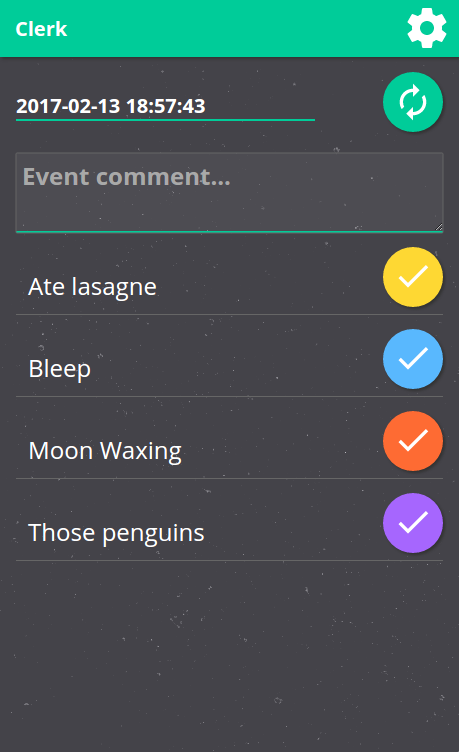

# Clerk #

Simple event-logger app.

 * Web based.
 * Easy to deploy.
 * Self-hosted & FLOSS.
 * Simple text based CSV format.
 * Allows multiple people to log events.
 * Mobile friendly - "Add to Home Screen" web-app.

### Install ###

 * Download [a release](https://github.com/chr15m/Clerk/releases) or `git clone` the `master` branch.
 * Copy the files to your PHP web hosting.

To require authentication, first create a password file:

	htpasswd -c /path/to/.htpasswd username

Then copy `./example.htaccess` to `.htaccess` and edit it.

### Data format ###

For every event logged the `event type`, `timestamp`, and `comment` are stored.

Events are stored in individual CSV files - one file per event type.

You can also download all CSVs stiched together with an extra column for the event name.

### Multi-user ###

If you have multiple users, clone the app folder for each user and create a unique htaccess login for each.

To create shared events either symlink one of the CSV files into each user's data directory or symlink the entire data folder.

### License ###

Copyright Chris McCormick, 2017. [GPLv3 licensed](./LICENSE.txt).
